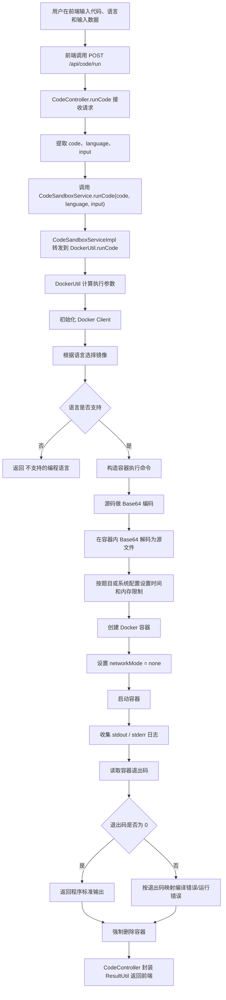
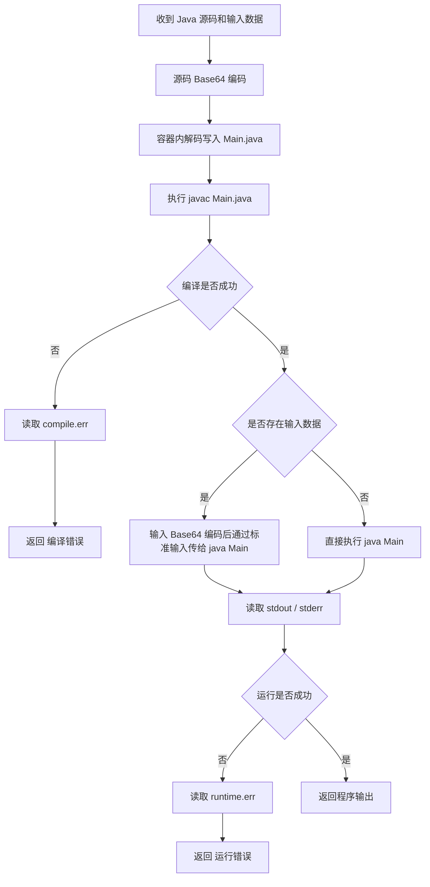
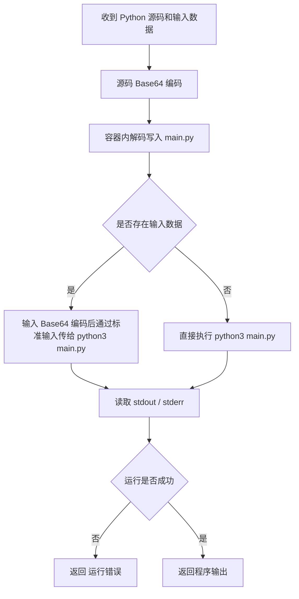
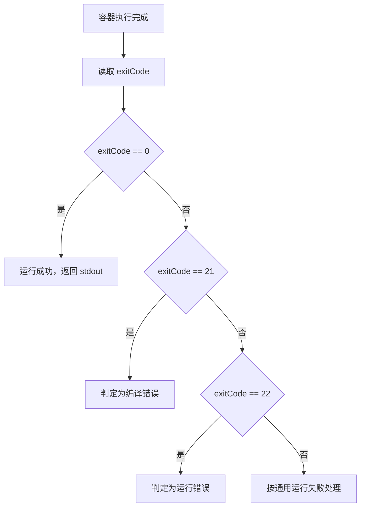

# 代码运行功能流程图

以下流程图基于当前项目中在线代码运行功能的最新实现生成，主要对应：

- `System/src/main/java/com/programming/controller/CodeController.java`
- `System/src/main/java/com/programming/service/impl/CodeSandboxServiceImpl.java`
- `System/src/main/java/com/programming/util/DockerUtil.java`

本版本已同步反映以下修复后的真实行为：

- 用户代码不再通过 `echo "..."` 写入容器，而是使用 `Base64` 解码落盘
- 输入数据会通过标准输入真正传给程序
- Java 代码会先编译再运行
- 错误会区分为“编译错误”和“运行错误”
- 题目内存限制会先做单位归一化，再传给 Docker

## 1. 在线代码运行主流程

## 2. Java 运行子流程

## 3. Python 运行子流程

## 4. 异常分类逻辑

## 5. 论文中可直接配套说明的文字

可直接配合流程图使用以下表述：

“系统在线代码运行功能采用控制层、业务层与容器执行层协作的方式实现。当前端提交代码运行请求后，后端控制器接收代码、语言与输入参数，并调用代码沙箱服务。代码沙箱服务进一步通过 Docker 工具类完成镜像选择、执行参数计算与容器调度。为避免源代码中的转义字符在 Shell 环境中被错误处理，系统先对用户代码进行 Base64 编码，再在容器内部解码落盘为源文件。对于 Java 程序，系统先完成编译，再根据用户输入通过标准输入流执行主程序；对于 Python 程序，则直接在容器中解释执行。执行结束后，系统收集标准输出、标准错误和退出码，并区分编译错误、运行错误与成功输出，最终销毁容器并将结果统一返回前端页面。” 

## 6. 当前实现说明

- 当前流程图已经同步到最新代码实现。
- 与旧版相比，已消除反斜杠转义导致的 Java 参考答案编译异常问题。
- 当前 `input` 参数已实际参与程序执行，不再只是接口透传。
- 若后续你还要补“判题功能流程图”，可以在此基础上继续扩展 `/api/submit/commit` 这条链路。
