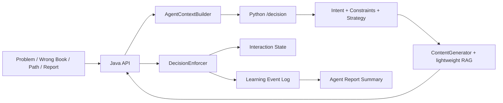

# Learning Agent Architecture

## Scope

The Learning Agent is a unified decision chain for problem coaching, submission advice, wrong-book reflection, learning-path recommendation, and learning report summaries.

Phase 0-8 keeps the external problem-page APIs stable:

- `POST /api/agent/advice/{submitId}`
- `POST /api/ai/problem-agent/chat`

Phase 7 adds product entry APIs:

- `POST /api/agent/wrong-book/{wrongItemId}/reflect`
- `POST /api/agent/learning-path/{pathId}/level/{levelId}/recommend`
- `GET /api/agent/report/summary`

## Boundary

Java remains the only trusted state owner.

- validates user ownership and path/wrong-book access
- builds `AgentContextV2`
- calls Python `/decision`
- enforces final action constraints
- writes interaction state, event logs, and feedback logs
- serves report summaries from Java-managed data

Python remains a decision and content service.

- routes intent
- filters candidate actions
- selects one of the fixed action types
- enriches content with lightweight problem-level knowledge
- returns `AgentDecisionV2`

The LLM and RAG layer do not grant answer access, mutate `learning_stage`, or write feedback.

## Event Flow

## Entry Semantics

| Entry | trigger_source | Default action |
| --- | --- | --- |
| Problem page chat | `PROBLEM_PAGE_CHAT` | Intent-dependent |
| Run failure | `RUN_RESULT` | `HINT` or `DIAGNOSE` |
| Submit failure | `SUBMISSION_RESULT` | `HINT`, `DIAGNOSE`, or `EXPLAIN` |
| Wrong book detail | `WRONG_BOOK_ENTRY` | `REFLECT` |
| Learning path level | `LEARNING_PATH_ENTRY` | `RECOMMEND` |
| Manual full solution request | `MANUAL_HELP_REQUEST` | `REVEAL_ANSWER` only after Java constraint approval |

## Data Scope

`learning_event_log` and `agent_feedback_log` support both problem-level and non-problem entries with:

- `entry_ref_type`
- `entry_ref_id`
- `path_id`
- `level_id`
- `wrong_item_id`

Path-level events may have `problem_id = NULL`, so they do not pollute a specific problem's `learning_stage`.
